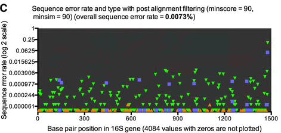

## Data

The data analyzed here is the S. aureus sample analyzed in the paper "Evaluation of PacBio sequencing for full-length bacterial 16S rRNA gene classification", Josef Wagner, Paul Coupland, Hilary P. Browne, Trevor D. Lawley, Suzanna C. Francis and Julian Parkhill, BMC Microbiology, https://doi.org/10.1186/s12866-016-0891-4

They performed full-length 16S rRNA gene sequencing using "forward primers (7f 5’ AGAGTTTGATYMTGGCTCAG 3’)" and "reverse primer (1510r 5’ ACGGYTACCTTGTTACGACCT 3’)". After standard PacBio processing, further bionformatics used the mothur software package.

They report: "We also identified that substitution errors were not evenly distributed across the full-length bacterial 16S  rRNA gene but were detected at hotspots across the full-length bacterial 16 s rRNA gene (Fig. 2)... Sequencing error was determined with Mothur using **Staphylococcus aureus M1** as a reference sequence." Blue squares are inferred subsitution error rates under their high stringency processing parameters (green triangles are deletions).



Of note, in the Genome Announcement of S. aureus M1, https://doi.org/10.1128/genomeA.00336-13, they state: "it [was] possible to close all gaps except four of five ribosomal clusters. These ribosomal clusters are almost identical, based on their 5-fold higher coverage than the genome." That is, only one copy of each rrn gene was in the M1 reference genome.

Also, from correspondence:

> I got the S. aureus DNA from my work colleague few years ago.
> I have used the DNA since then for my PCR and sequencing positive controls.
> I did some search in my lab books and it is a TW20 strain.

## Purpose

Here we revisit the analysis of the PacBio S. aureus dataset in Wagner et al, with a particular focus on their findings of high rates of substition errors at specific positions in the full-length 16S rRNA gene. 

## Setup

Using a couple versions of the ccs processed file
```{r init, warning=FALSE, message=FALSE}
library(dada2);packageVersion("dada2")
library(ggplot2); packageVersion("ggplot2")
path <- "~/Desktop/LRAS/Data/Saureus" # CHANGE ME to directory containing the fastq file
fn <- file.path(path, "m150206_s1_p0_1_ccs_minpass_2_minprdaccry_99.fastq.gz")
F7 <- "AGAGTTTGATYMTGGCTCAG"
R1510 <- "ACGGYTACCTTGTTACGACCT"
rc <- dada2:::rc
```

## Process with DADA2

Removing primers and extraction region in between for each file:
```{r primers}
nop <- file.path(path, "noprimers", basename(fn))
dada2:::removePrimers(fn, nop, primer.fwd=F7, primer.rev=rc(R1510), orient=TRUE, verbose=TRUE)
```

Filter:
```{r}
filt <- file.path(path, "noprimers", "filtered", basename(fn))
track <- filterAndTrim(nop, filt, minQ=3, rm.phix=FALSE, maxEE=2, verbose=TRUE)
```

So the filtering pretty much knocks down the min predicted accuracy thing.

Dereplicate:
```{r}
drp <- derepFastq(filt, verbose=TRUE)
```

Learn errors:
```{r}
err <- learnErrors(drp, errorEstimationFunction=PacBioErrfun, BAND_SIZE=32, multithread=TRUE)
```

Denoise:
```{r}
dd <- dada(drp, err=err, BAND_SIZE=32, multithread=TRUE)
dd
```

## Crude Evaluation

```{r}
dd$clustering[,-1]
```

The bottom 2 are marginal. Check for chimeras.

```{r}
unname(isBimeraDenovo(dd))
```

Chimeras. So, in this dataset we believe there are 5 true sequences.

## Reference check againt nt

BLAST the full set of 7 against nt.

```{r}
##dada2:::pfasta(dd)
```

1. Exact match (100% coverage, 100% ID) to many S. aureus strains (>100).
2. Exact match to S. aureus strain: V521.
3. Exact match to many S. aureus strains (~50).
4. Exact match to S. aureus strains: NCTC9944, MRSA107, TOHH628, V605, V521, Gv88, TW20.
5. Exact match to S. aureus strains: V605, V521, TW20.
6. (Chimera) Exact match to many S. aureus strains (~50).
7. (Chimera) Exact match to S. aureus strain: CMRSA-3.

rrndb lists S. aureus as having 5 or 6 copies of the 16S gene almost always: https://rrndb.umms.med.umich.edu/

## Reference check against TW20

Now consider the TW20 genome from ["Genome Sequence of a Recently Emerged, Highly Transmissible, Multi-Antibiotic- and Antiseptic-Resistant Variant of Methicillin-Resistant Staphylococcus aureus, Sequence Type 239 (TW)"](http://jb.asm.org/content/192/3/888.full). 

>The sequence and annotation of the TW20 genome have been deposited in the EMBL database under the accession numbers FN433596, FN433597, and FN433598."

> Staphylococcus aureus subsp. aureus TW20, taxid:663951, accession:FN433596.1
> Plasmid (large): FN433597.1; Plasmid (small): FN433598.1

In a BLAST against TW20 (accession FN433596.1) 1/3/4/5 are exact matches. sq2 has 1 mismatch.
No 16S hits to the plasmids. TW20 is listed as having 5 copies of the 16S rRNA gene: https://rrndb.umms.med.umich.edu/genomes/GCF_000027045.1

In summary, these sequences look like they come from TW20, or a very close relative (w/ one rrn gene changed).

## Reference check against M1

In the Genome Announcement of S. aureus M1, https://doi.org/10.1128/genomeA.00336-13: 

> The [M1] genome data have been deposited in GenBank with accession number HF937103 for the chromosome and HF937104 for the plasmid."

In a BLAST againt M1 (accession HF937103) 1 is an exact match, none of the others are. Also, only one rrn gene is found in the reference.

## Plot mismatch positions

Let us consider what we think are the true sequences, and plot their mismatches against sq1 (i.e. the M1 reference gene) and see if we can recapitulate Fig 2C.

Collect the mismatches between each sequence and the most abundant sequence.
```{r}
sq <- dd$sequence[2:5]
ref <- dd$sequence[[1]]
get_subs <- function(query, ref) {
  al <- nwalign(query, ref)
  subs <- dada2:::strdiff(al[[1]], al[[2]])
  colnames(subs) <- c("pos", "sub", "ref")
  subs$abund <- dd$denoised[query]
  subs
}
subdf <- do.call(rbind, lapply(sq, get_subs, ref=ref))
```

Plot a version of Figure 2C based on the intra-ASV mismatches.
```{r}
tot.nt <- sum(nchar(dd$sequence) * dd$clustering$abundance)
ggplot(data=subdf, aes(x=pos, y=abund/tot.nt)) + geom_point(color="blue", shape="square", size=2) + 
  scale_y_log10(limits=c(0.00001,1), breaks=4^c(-7, -6, -5, -4, -3, -2, -1, 0),
                labels=c("0.000061", "0.000244", "0.000977", "0.003906", "0.015625", "0.0625", "0.25", "1")) + 
  scale_x_continuous(limits=c(0, 1500), breaks=c(0, 300, 600, 900, 1200, 1500)) +
  theme(panel.grid=element_blank(), panel.background=element_rect(fill="black")) +
  ylab("Sequence error rate") + xlab("Base pair position in 16S gene")
```

Yep, that's the same plot (modulo the edge effect sub peak at ~1500, and the deletions). The non-random substitution hotspots at certain positions are just due to the incomplete reference genome with just 1 rrn operon.
